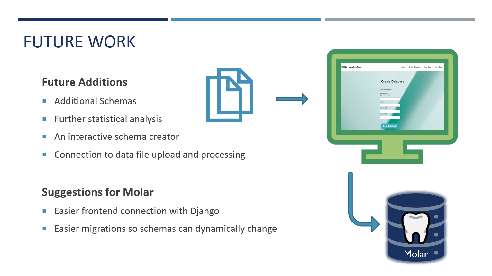

# Hackathon : MolEx

MolEx: Extending **Mol**ar to **Ex**perimental data.

This UKISU team repo for  hackathon hosted by Acceleration Consortium. The team was placed 3rd.

# Challenge

# Our solution

# The product

# Demo

